# Curling Canada Scraper
- **Author:** Matthew Buglass 
- **Copyright (c) 2021. Edwards School of Business - University of Saskatchewan**
- **Version:** 02.00.00
- **Maintainer:** Matthew Buglass
- **Email:** scrapefl@gmail.com
- **Status:** Stable Release
- Curling data collected from and used with permission of [Curling Canada](https://stats.curling.io/)

# About
This program allows for scrapping data from Canadian National curling championships
dating back to the 1928 MacDonald Brier. Additionally, users can customize their data
sets and preview them before exporting to a CSV file format.

# Change Log
*Version 02.00.00:* Fixed bug issues related to creating neural network models. Models are
saved with more extensive statistics and can be loaded into the program to make predictions. Long
drop-down menus are displayed alphabetically to improve navigation\
*Version 01.00.00:* Initial stable release. Includes neural network model training and saving.\
*Version 00.01.20:* Various bug fixes for retrieving CSV data.\
*Version 00.01.10:* Hotfix for function adding in the analysis section.\
*Version 00.01.00:* Initial Beta Release.

---

# Features
## Data Scraping
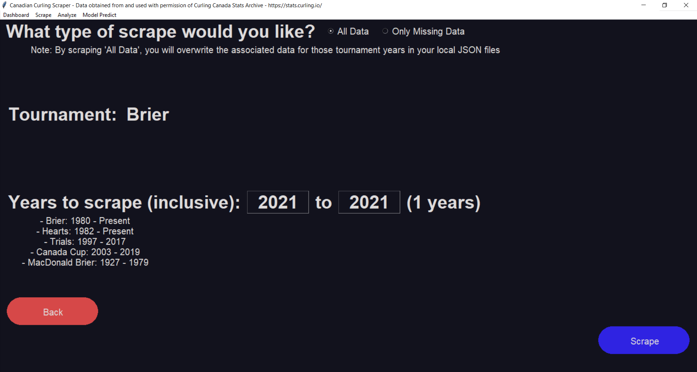

By clicking "Scrape" in the top left toolbar users can choose to scrape only years
of data that are not on file, or scrape all new data in case of database changes or
updates. Users can choose one of 5 professional curling tournaments:
- Brier
- Hearts
- Men's Trials
- Men's Canadian Cup
- MacDonald Brier

After choosing the tournament and years, users can see progress updated from 
the scrape while they wait for it to complete. After the data is on file locally,
summary statistics can be viewed for each tournament and year on the main screen
dashboard.

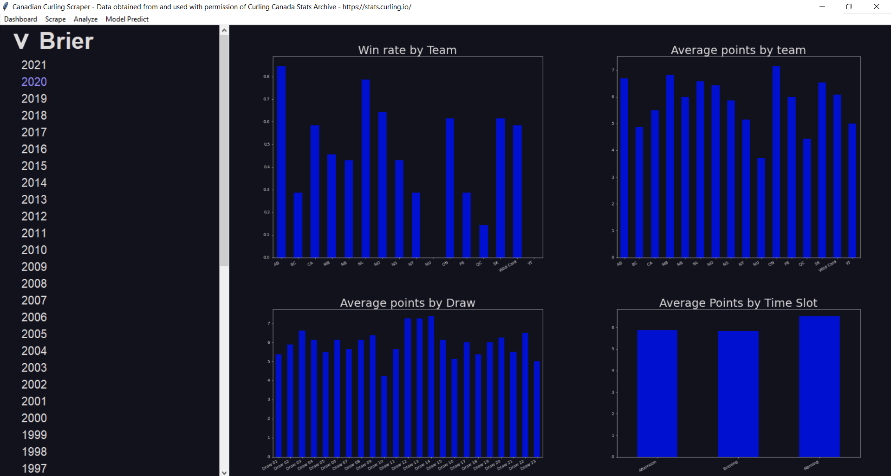

## Data Customization and Export
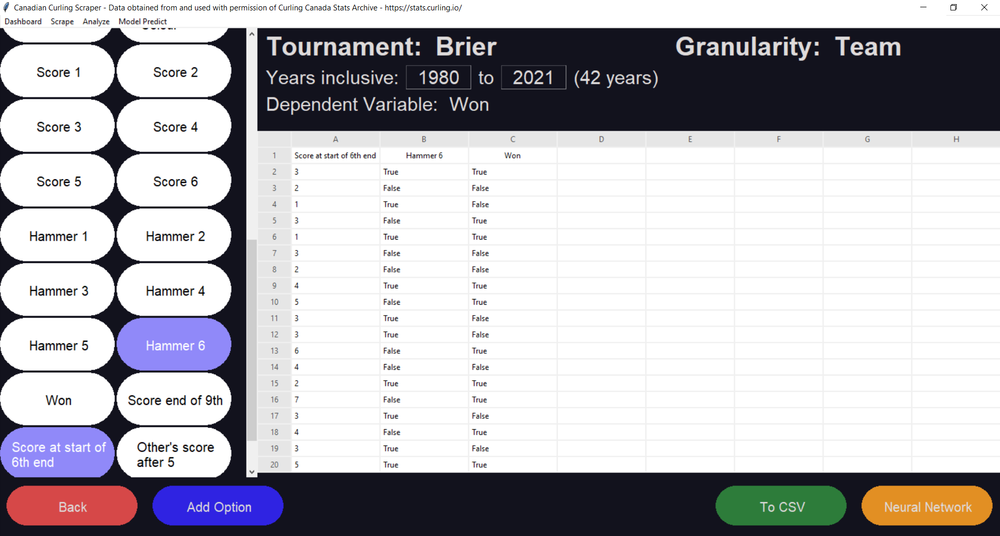

By clicking "Analyze" in the top Left toolbar users can choose a tournament
and year range of data that they would like to analyze.
- **Tournament:** This is which tournament is to be analyzed (i.e. Brier, Hearts, Men's, Women's, All, etc.)
- **Years:** The inclusive year range of data
- **Dependent Variable:** The data variable that you'd like to predict
  - Only one occurrence of a variable can appear in a data set (i.e. one variable cannot be 
    both dependent and independent)
  - The dependent variable will always appear to the far right of the data set
- **Granularity:** This is the level at which the data will be analyzed. The statistics from the 
  different levels of granularity can be combined using functions like add, sum, division, average, 
  standard deviation, and many more. There are 3 levels of granularity:
  - *Match* will yield one data line for each game played and is used for comparing matchups
  - *Team* will yield two data lines for each game played (one for each team)
  - *Player* will yield one data line for each player in each game
- **Data Variables:** The data variables are on the left side of the screen and can be clicked on
  to be added as independent variables to the data set. The variables will be added to the data set
  in the order that they were clicked on. Selected variables will be highlighted.

### Adding Variable Options

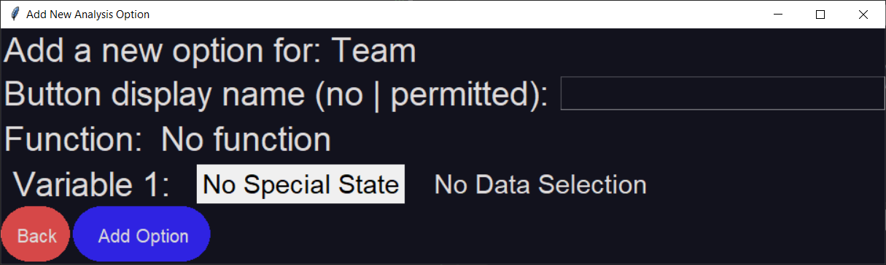
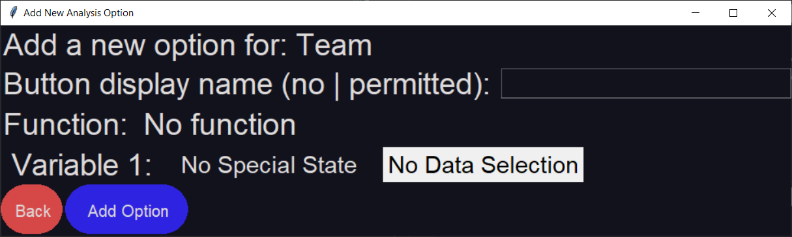

If the independent variable you need is not present, "Add Option" can 
be clicked on to add new variables. A new window will pop up presenting you with options to add 
custom data variables. Dropdown menus are available showing available functions, special states 
(winner, loser, red, yellow, etc.), and data elements to be used. Any previously created data variable can
be used as an input for the data selection.

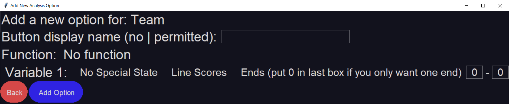

Additionally, if line scores are selected as a data element the ends necessary will need to be specified.

### Exporting to CSV

To export your data to a CSV, click the green "To CSV" button in the bottom right. The data set will be 
cleaned by removing any records that do not match the expected values for each data field, and a file dialogue 
window will be launched to permit you to save the file in your desired location.

## Neural Network Training

### Neural Network Settings
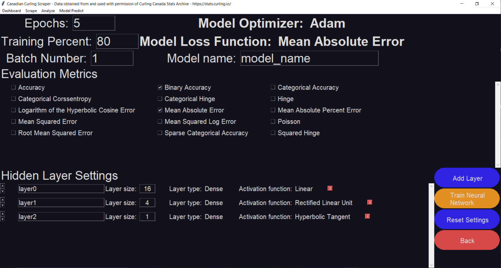
In this menu, you can customize the setting for a neural network that will be trained on the data set that
you just created. The dependent variable that you selected while customizing your data will be used as the
"target" for the model (ie. the thing that it will try to predict in the output layer), while the other data 
elements will be put into the input layer and used to predict the target. At the top of the screen are 
overarching settings for your model.

#### General Settings:
- **Epochs:** Epochs are the number of times that the model is to be shown the data.
  At each epoch, the data elements in the testing data set are shuffled and fed 
  through the network. The more epochs you use, the more accurate your model will be 
  (up to a point, because epoch number increases yield diminishing returns) but the 
  longer that your model will take to train.
- **Model Optimizer:** The optimizer is the algorithm or method that the model uses to 
  change the internal weights and biases of the nodes in a neural network. Different 
  optimizers are more or less useful depending on the nature of your analysis. 
  - For discussion on different optimizers, refer to 
  [Overview of various Optimizers in Neural Networks](https://towardsdatascience.com/overview-of-various-optimizers-in-neural-networks-17c1be2df6d5)
  written by Satyam Kumar.
- **Training Percent:** The training percent is a value from 1.0-100.0 that determines 
  how much of the dataset should be used to train, test, and validate the
  model. The number entered will be the percent of the dataset that is used
  for training. The remaining percent will be divided evenly into testing and 
  validation datasets.
- **Model Loss Function:** The loss function is what is used to calculate the difference
  in the model's prediction and its target. The model attempts to minimize the result from
  the loss function using the optimizer algorithm.
  - For information on the four main loss functions, (Mean Squared Error, Binary Crossentropy,
    Categorical Crossentropy, and Sparse Categorical Crossentropy) please see
    [Understanding different Loss Functions for Neural Networks](https://towardsdatascience.com/understanding-different-loss-functions-for-neural-networks-dd1ed0274718)
    written by Shiva Verma
- **Model Name:** This is what you would like to name your model. When saving, this will be the 
  folder name for the model.
- **Evaluation Metrics:** These are additional data elements that you would like to use 
  to judge your model. You can select none, one, or many. Accuracy and Binary Accuracy are 
  common selections.

Below those, there are the hidden layer settings. Hidden layers are processing steps
that are sandwiched between the input and output layers. The layers are processed 
sequentially from the top to the bottom. You can add, move, edit, or delete layers as 
you wish. The model can have none, one, or many hidden layers.
#### Hidden Layer Settings:
- **Name:** This is what you'd like to name the layer
- **Layer Size:** This is the number of nodes in the layer. Each node will be initialized 
  with the activation function of the layer and will be independently updated as the 
  model is trained.
- **Layer Type:** The layer type defines how the outputs of the previous layer are 
  directed to the inputs of this layer.
  - Right now only the Dense layer type is available. With the Dense layer type, each
  output of the previous layer is used as an input.
- **Activation Function:** The activation function is the mathematical relationship
  between a node's input and output. As an example, in single variate linear regression,
  we have an input and an output, and the mx+b function that results from our regression
  is analogous to a node's activation function. 
  - For more explanation on the types of activation functions, check out 
    [Activation Functions in Neural Networks](https://towardsdatascience.com/activation-functions-neural-networks-1cbd9f8d91d6)
  writen by Sagar Sharma.
  
## Neural Network Training and Prediction
### Network Training
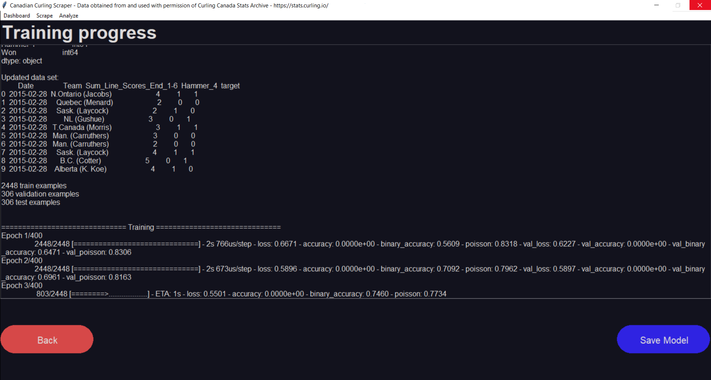
After hitting "Train Neural Network" on the settings screen, the dataset you created will 
be cleaned and both it and your settings will be used to create and train a neural 
network. While training, progress updates will be displayed on the screen.

- **Known Problems:** At this stage, if the mouse is clicked a message on the top bar of
  the application will say "Not Responding". Do not worry. Your model is still training, 
  the window is just not updating. After the model has finished training, the screen will 
  update with the results from the training

After your model has finished training, you have the option to save it for later. After clicking 
"Save Model", you will select the directory that you would like your models to be saved in. A 
folder with your model's name will be created in that directory.

### Network Prediction
By clicking "Model Predict" on the menu bar, you will be prompted to pick the folder
of the model that you would like to make predictions from. Make sure that the folder you 
select has the header "curling_ai_model_" because all files in that folder are required.

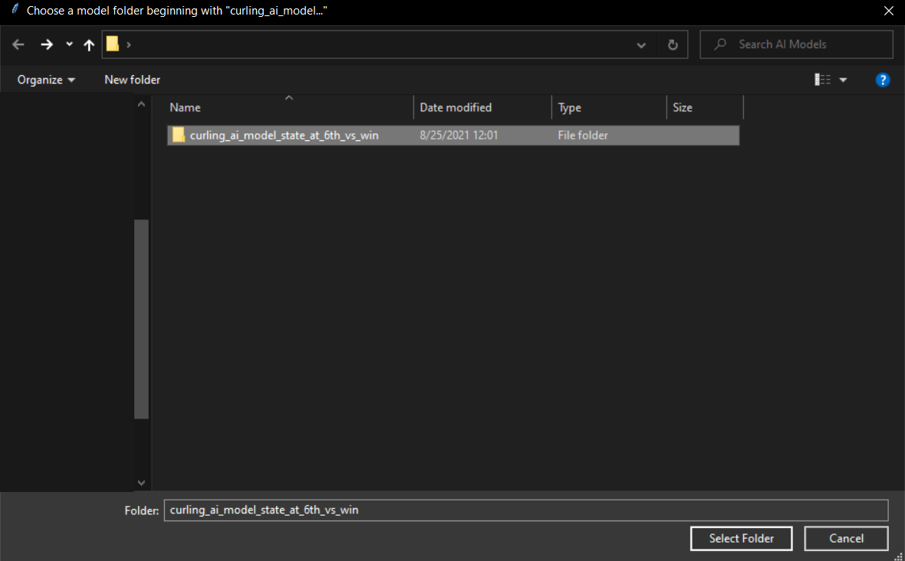

Once the model loads, you can input values and select different variables to make  predictions on the trained model. Your most recent prediction will appear on the 
top of the screen.

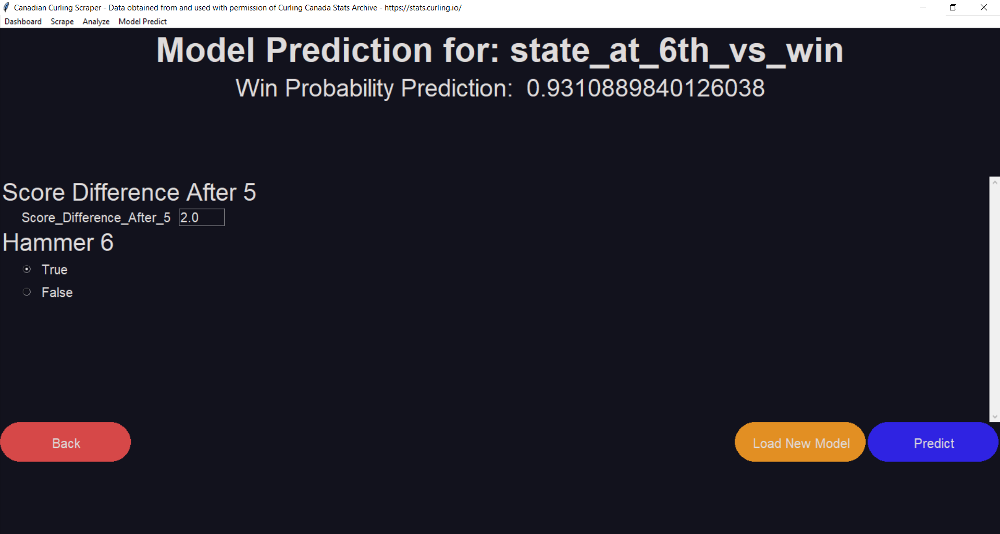

If you look inside the "curling_ai_model_" you'll find the files that describe the 
saved model. By opening the stats text file, you can see the settings that were used 
to train the model, its layer structure, what it was trying to predict, and the results 
of its evaluation metrics.

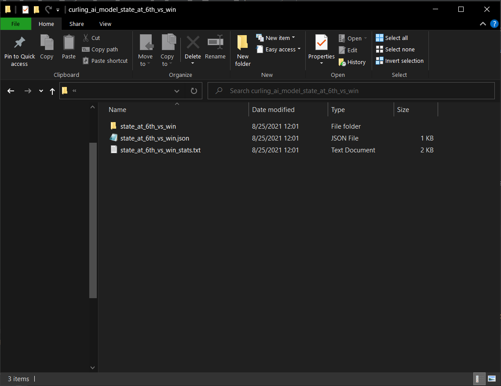
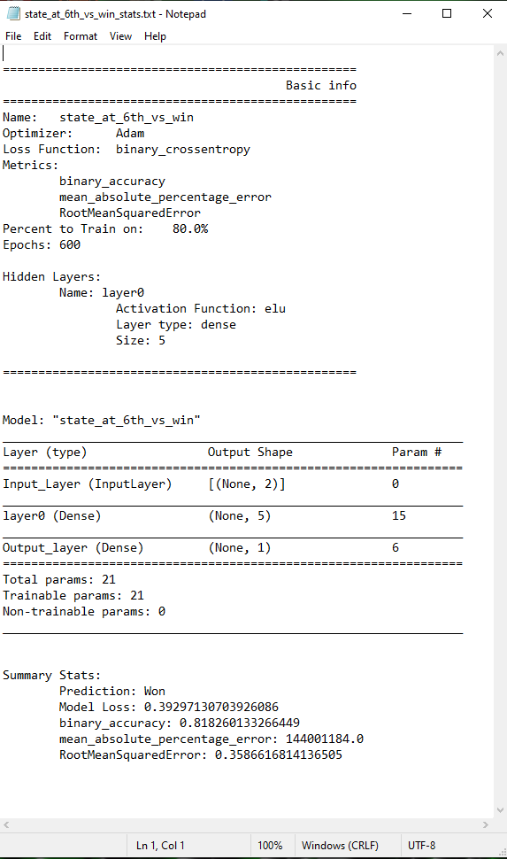

---
# Bug Reporting
- If you find any bugs or have suggestions, please fill out our 
[Bug Reporting Google Form](https://forms.gle/a81KZ8MF55q5G7bs9).
- You can see the progress and status of different bugs in the 
[Bug Reporting Task Board](https://trello.com/b/3jCCACQV/curling-scrapper-bug-reporting)